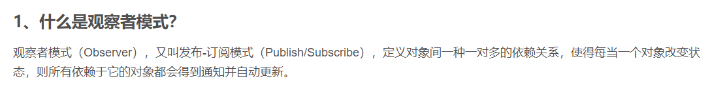
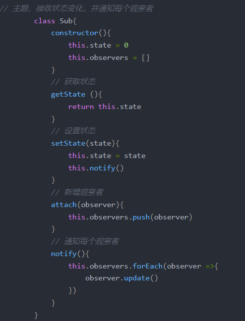
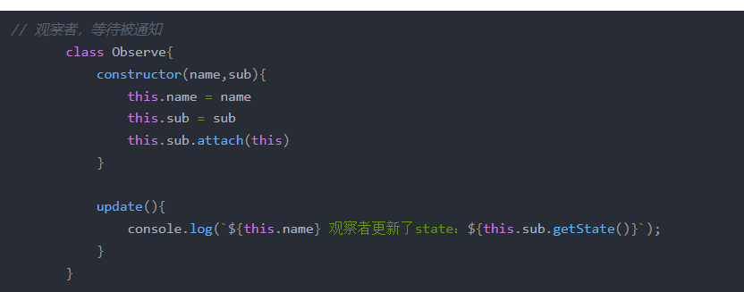
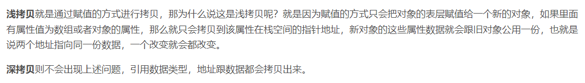
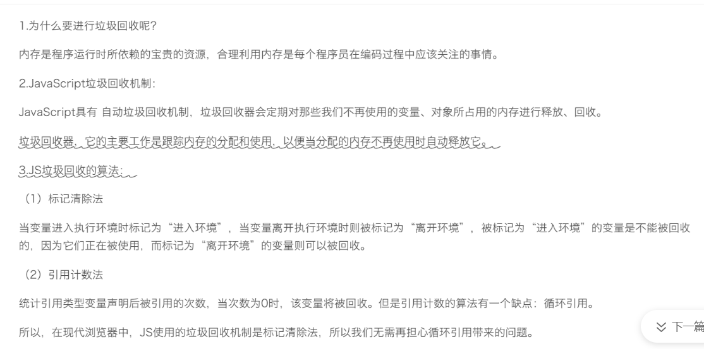

4.观察者模式

6.深拷贝浅拷贝

5、 https://baijiahao.baidu.com/s?id=1678432580223783062&wfr=spider&for=pc
https://www.cnblogs.com/houxianzhou/p/15319126.html

7、

8.排序
快速排序
快速排序的主要思想是通过划分将待排序的序列分成前后两部分，其中前一部分的数据都比后一部分的数据要小，然后再递归调用函数对两部分的序列分别进行快速排序，以此使整个序列达到有序。

堆排序
堆排序的思想就是先将待排序的序列建成大根堆，使得每个父节点的元素大于等于它的子节点。此时整个序列最大值即为堆顶元素，我们将其与末尾元素交换，使末尾元素为最大值，然后再调整堆顶元素使得剩下的 n-1n−1 个元素仍为大根堆，再重复执行以上操作我们即能得到一个有序的序列

归并排序
归并排序利用了分治的思想来对序列进行排序。对一个长为 nn 的待排序的序列，我们将其分解成两个长度为
的子序列。每次先递归调用函数使两个子序列有序，然后我们再线性合并两个有序的子序列使整个序列有序。

选择排序
每一轮选取未排定的部分中最小的部分交换到未排定部分的最开头，经过若干个步骤，就能排定整个数组。即：先选出最小的，再选出第 2 小的，以此类推。

插入排序
每次将一个数字插入一个有序的数组里，成为一个长度更长的有序数组，有限次操作以后，数组整体有序。

希尔排序
思想来源：插入排序的优化。在插入排序里，如果靠后的数字较小，它来到前面就得交换多次。「希尔排序」改进了这种做法。带间隔地使用插入排序，直到最后「间隔」为 11 的时候，就是标准的「插入排序」，此时数组里的元素已经「几乎有序」了；

9.类型转换机制
一、类型转换的方法和应该注意的问题：
1.转换为布尔型：
（1）用两次非运算(!):
!!5 ==> true
（2）用布尔型的构造函数：
new Boolean(5) == > true
值转换为布尔类型为false：
0，+0，-0，NaN，""(空字符串),undefined,null
除上面的值其他值在转换以后为true，需要特别提到的是:
"0",new Object(),function(){}

2.转换为字符串类型：
（1）加上空字符串""：
123 +　"" = "123"
（2）用字符串构造函数：
new String(123) = "123".
需要特别注意的转化：
+0 ==> "0"
-0 ==> "0"
-Infinity ==>"-Infinity"
+Infinity ==>"+Infinity"
NaN ==> "NaN"
undefined ==> "undefined"
null ==> "null"
new Object() ==> "[object Object]"
function(){} ==> "function(){}"

3.转换为数值型：
（1） 取正（+）， 减零 （-0）， 乘一，（*1），除以一（/1),取负（-，这个得到相反的值）。
+"123" = 123
+true = 1
（2）用构造函数Number();
new Number("123") = 123
几个需要特别注意的转化：
""（空字符串） ==> 0
"010" ==> 10
"0x10"(16进制) ==> 16
"-010" ==> -10
"-0x10" ==> NaN
undefined ==> NaN
null ==> 0
true ==> 1
false ==> 0
new Object() ==> NaN
new function(){} ==> NaN

二、隐式类型转换：
(1)二元加法运算（+）：如果两个操作数中有一个是String类型，将把两个操作数转换为String类型再相加。
如果两个操作数中没有字符串类型，那么将把两个操作数转换为数值类型再做运算。
举例：
"123"+123 = "123123";
123+123 = 246
true + true = 2
true + undefined = NaN （因为undefined转换为数值为NaN,所有结果为NaN)
true + null = 1 (null转换为数字是0)
"123" + null = "123null" (包含字符串将转化为字符串相加)
"123" + undefined = "123undefined" （undefined同样适用）
1 + 2 + "123" = "3123" (1+2是首先按照数值型计算的)
(2)二元减乘除运算（-*/):因为只有数值类型才有 - * / 运算，所以会先将两个操作数转换为数值型再做运算。
"123"-123 = 0
(3)一元取正（+），取负运算符(-):取正或者取负都是针对数值型的运算，所以会将操作数转换为数值型再做运算。
+"123" = 123
-"123" = -123
+"123e" = NaN
+"123f" = NaN
+"123e-2" = 1.23
(4)一元非(!)运算符:非运算符需要将操作数转化为布尔类型。
!"123" = false
!!"123" = true
!123 = false
!!123 = true
(5)逻辑运算符（&&）和（||）：
在&&或者||的两侧被判断的时候会被转为布尔类型进行判断，
但是我在测试的时候却发现一个有趣的事情。
&&运算符：如果有一个项为false，那么表达式返回false,如果所有的项都不为false，那么表达式返回最右边一个项的原始值。
举例：
123 && 23 && 45 返回 45,而不是我们想象中的true.
所以如果有 123 && 23 == true 那么应该是false。
至于if(123 && 23) 认为是true那应该是把23转换为布尔类型了。
||运算符：
对 || 测试的结果也和我想象的不一样，|| 返回第一个转换以后不为false的值，如果都为false,它将返回最后一个为false的值（未进行类型转化之前的值）。
举例：
123 || 23 返回 123，而不是想象中的true.
false || null 返回null， 而不是想象中的false。
三、类型转换函数
1.parseFloat转换为浮点数：
字符解析函数获取每一个字符直到遇到不属于数值的字符,然后返回它已获取的数值.
几个需要特别注意的：
""（空字符串) ==> NaN
"123e-2" == > 1.23 (科学计算法是可以识别的）
"010" ==> 10 (8进制不能识别)
"0x10"==> 0 (16进制不识别)
"-010" ==> -10
null,undefined,true,false,new Object(),function(){} ==> NaN
2.parseInt转换为有符号整数:
跟parseFloat相似，但是他会把小数位舍掉（注意不是四舍五入，是完全舍弃，跟Math.floor处理方式一样),而且他可以识别八进制和16进制表示方式:
123e-2 == > 1
"123e-2" ==> 123
"010" == > 8
"0x10" ==> 16
"-010" == > -8
"-0x10" ==> -16
null,undefined,true,false,new Object(),function(){},-Infinity +Infinity NaN ==> NaN
3.三个取整函数的区别：
（1）Math.ceil():“天花板”，很形象吧？就是取大于等于参数的最小整数。
8.7 == > 9
-8.7==> -8
（2）Math.floor():"地板",取小于等于参数的最小整数。
8.7 ==> 8
-8.7 ==> -9
（3）Math.round():"四舍五入"取整数。

10.ecmascript的基本数据类型有5种
ecmascript的基本数据类型有5种：1、Undefined类型，表示未定义；2、Null类型，表示一个“空”值，即不存在任何值，常用来定义空对象指针；3、Number类型；4、String类型；5、Boolean类型。

数据类型分为两类别：基本数据类型，复杂数据类型
基本数据类型：Undefined、Null、boolean、Number、String
复杂数据类型：Oobject

ECMAScript中有5中基本数据类型：Undefined、Null、Number、String、Boolean，还有一种复杂数据类型Object（由无序的名值对组成）。

对于几个区分不是很清楚的数据类型做了总结如下：

1、通过typeOf操作符来判断变量的数据类型

"undefined"———若值未定义；

"boolean"——若值是布尔值；

"string"——若值是字符串；

"number"——若值是数值；

"object"——若值是对象或null；

"function"——若值是函数；

例：

var message = "some string";

alert(typeOf message); //"string"

alert(typeOf(message));　//"string"

alert(typeOf  95); //"number"　

2、Undefined 类型（值为undefined）

对var变量声明了但未对其初始化，则为undefined。

例：

var  message；

alert(message == undefined) ;    //true

3、Null 类型（值为null）

null值表示的是一个空对象指针。

例：

var   obj = null；

alert(typeOf obj);  //"object"

4、Number类型

这种类型的值比较多，重点说一下NaN. NaN表示的是本来要返回数值的操作数未返回数值的情况，即在ECMAScript中任何数值除以非数值会返回NaN。NaN有两个特点：一是任何涉及NaN的操作都会返回NaN;二是NaN与任何值都不相等，包含NaN本身。

例:

alert(NaN == NaN);    //false

isNaN()函数，这个函数接收一个参数，这个参数可以是任何类型，通过isNaN()函数可以判断这个参数是否"不是数值"，该函数接收到一个值后，会尝试将其转换为数值，任何不能转换为数值的值都会导致这个函数返回true。

例：

alert(isNaN(NaN)) ;    //true

alert(isNaN(10));  // false

alert(isNaN("10"));  //false

alert(isNaN("blue"));//true（不能转换成数值类型）

alert(isNaN(true)); // false (true可以转换成1)

5、String 类型

字符串（String）类型是一段以单引号''或双引号""包裹起来的文本，例如 '123'、"abc"。需要注意的是，单引号和双引号是定义字符串的不同方式，并不是字符串的一部分。

定义字符串时，如果字符串中包含引号，可以使用反斜杠\来转义字符串中的引号，或者选择与字符串中不同的引号来定义字符串，如下例所示：

var str = "Let's have a cup of coffee.";  // 双引号中包含单引号

var str = 'He said "Hello" and left.';    // 单引号中包含双引号

var str = 'We\'ll never give up.';        // 使用反斜杠转义字符串中的单引号

6、Boolean 类型

布尔（Boolean）类型只有两个值，true（真）或者 false（假），在做条件判断时使用的比较多，您除了可以直接使用 true 或 false 来定义布尔类型的变量外，还可以通过一些表达式来得到布尔类型的值，例如：